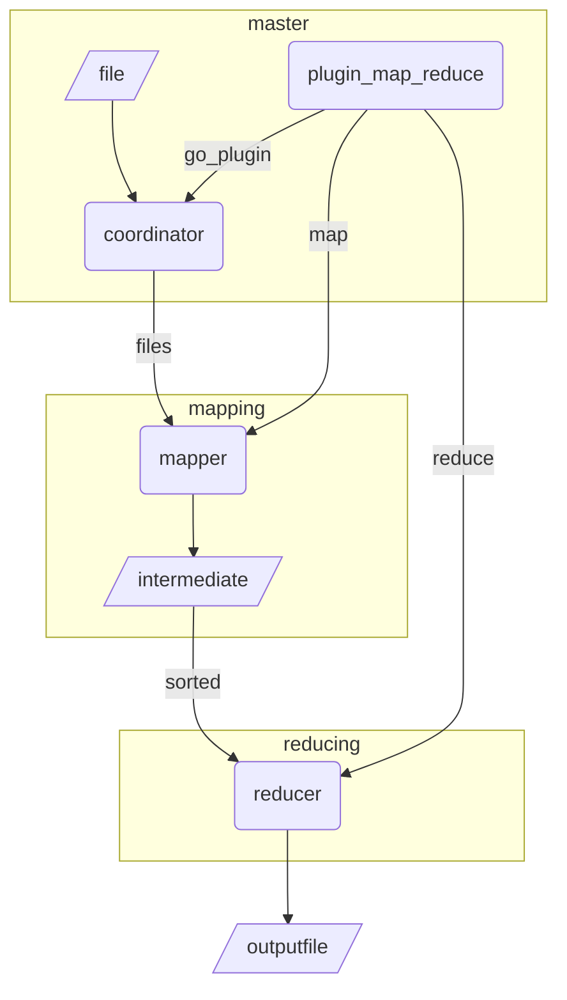
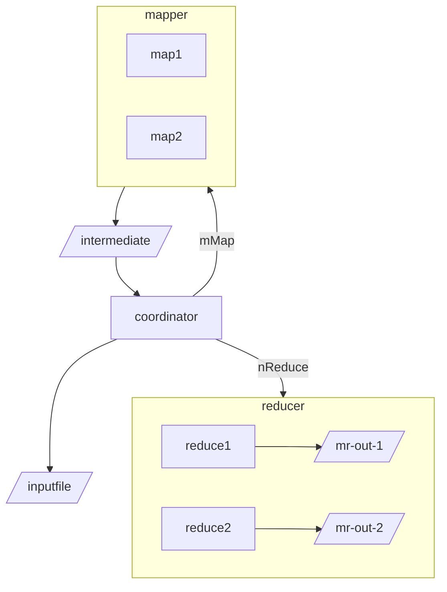

# Map Reduce

[toc]


## 1. Sequential MR

one **goroutine** work as both coordinator and worker



## 2. Distributed MapReduce



## 3. Go project structure

### GOPATH

early days project should all be put under `$GOPATH/src`, which is essential for go to detect the import path for each package. The shortcoming for this is that all project should be put in one root dir.

### GO Module

modularize the project,  separate module can locate in different dir with`go.mod` in its root dir defining the name of this module. local import can be defined by `import "module_name/package_name"`


## 4. Go RPC with UDS

https://medium.com/rungo/building-rpc-remote-procedure-call-network-in-go-5bfebe90f7e9

https://eli.thegreenplace.net/2019/unix-domain-sockets-in-go/

https://golang.org/pkg/net/rpc/

UDS： Unix domain sockets, for IPC in the local machine

Working with UDS is exactly the same as working with web socket, but instead of providing an IP and port, we provide an used file as the identifier for the 'location' of the service

UDS is faster and has lower lattency in comparison with TCP communication

### Go rpc


Go RPC package can easily cooperate with the HTTP server. Generally speaking, HTTP handler works as the server stub here. RPC is using default uri for the incoming request. if the uri matches, HTTP handler parse the argument and invokes the procedure. 

**Note**:

Only methods that satisfy these criteria will be made available for remote access; other methods will be ==**ignored**==

```
- the method's type is exported.
- the method is exported.
- the method has two arguments, both exported (or builtin) types.
- the method's second argument is a pointer.
- the method has return type error.
```

The procedure should look like:

```
func (t *T) MethodName(argType T1, replyType *T2) error
```


## Implementation Note

coordinator:

```go
type Coordinator struct {
	reduceTaskQueue  chan *Task
	mapTaskQueue     chan *Task
	mapTaskStatus    map[string]*Task // task id -> task 
	reduceTaskStatus map[string]*Task // task id -> task
	mapLeft          int // manage done state
	reduceLeft       int // manage done state
	done             bool
	mu               sync.Mutex
}
```

worker is just in loops asking the coordinator for task via RPC, and when finished its task call finish RPC to notify the master that this task is done.

Concurrency:

Note that Coordinator is shared by all thread in serving the incoming rpc

- reduceTaskQueue and MapTaskQueue is used to dispatch the task for multiple workers
- mu is used to protect the status map and also mapLeft, reduceLeft, done

Task status management:

Mainly for crash recovery

### Thoughts

- one Mutex may decrease the throughput, not quite efficient for concurrency

## Other solutions out there

